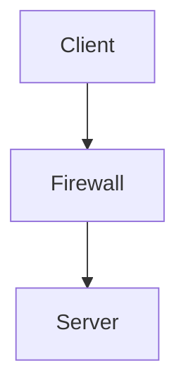

# Markdown Visualizer for VS Code

A Visual Studio Code extension for rendering Markdown documents with support for Marp presentations, Mermaid diagrams, and KaTeX mathematical expressions.

The project explores VS Code extension development, Webview-based interfaces, Markdown processing, client-side rendering, and synchronization between the editor and the generated preview.

## Overview

Markdown Visualizer provides a dedicated preview panel inside VS Code.

The extension:

- renders Markdown documents using Marp;
- supports Mermaid diagrams;
- supports mathematical expressions through KaTeX;
- updates the preview when the Markdown document changes;
- synchronizes the preview position with the editor;
- runs the rendered document inside a VS Code Webview.

## Technical Stack

- JavaScript
- Node.js
- Visual Studio Code Extension API
- VS Code Webviews
- Marp
- Mermaid
- KaTeX
- Markdown-it
- Marked
- Unified / Remark
- Puppeteer
- ESLint
- VS Code Extension Testing

## Architecture

The extension is built around a VS Code Webview.

```text
                         VS Code
                            |
                            v
                  +-------------------+
                  |  Extension Host   |
                  |                   |
                  |  extension.js     |
                  +---------+---------+
                            |
                            | Markdown content
                            v
                  +-------------------+
                  | Markdown / Marp   |
                  | Rendering         |
                  +---------+---------+
                            |
                            | Generated HTML / CSS
                            v
                  +-------------------+
                  |    VS Code        |
                  |     Webview       |
                  +----+---------+----+
                       |         |
                       v         v
                   Mermaid     KaTeX
                       |
                       v
                    SVG / HTML
```

The main extension entry point registers the preview command, creates the Webview, renders the document, and listens for document changes.

## Main Components

### `extension.js`

The main VS Code extension entry point.

Responsibilities include:

- registering the `visualizer.markdownPreview` command;
- validating that the active document is Markdown;
- creating the Webview panel;
- rendering Markdown through Marp;
- loading Mermaid and KaTeX in the Webview;
- updating the preview when the source document changes;
- connecting the editor to the scroll synchronization mechanism.

The Webview is opened in a second editor column and allows scripts required by the preview renderer.

### `scroll.js`

Implements synchronization between the Markdown editor and the preview.

The implementation observes the editor's visible ranges and calculates a weighted scroll position. Markdown slide separators receive a significantly higher weight so that scrolling behaves more naturally for Marp presentations.

### `renderer.mjs`

Contains an alternative Markdown processing pipeline based on the Unified ecosystem.

It uses:

- `remark-parse`
- `remark-gfm`
- `remark-mermaid`
- `remark-html`

This component currently exists separately from the main Marp-based rendering path.

## Webview Security

The preview is implemented using a VS Code Webview with a Content Security Policy.

The extension generates a nonce for its inline scripts and defines explicit resource policies for scripts, styles, fonts, and images.

The current CSP includes:

```text
default-src 'none'
script-src 'nonce-...' https://cdn.jsdelivr.net 'unsafe-eval'
style-src 'unsafe-inline' https://cdn.jsdelivr.net
font-src https://cdn.jsdelivr.net
img-src https://cdn.jsdelivr.net data:
```

This is an area of the project that can be further hardened, particularly around external resources and the use of `unsafe-eval`.

The project therefore provides a practical environment for exploring the security considerations of VS Code Webviews and client-side content rendering.

## Markdown Rendering

The extension uses Marp as the primary rendering engine:

```javascript
const marp = new Marp({
    html: true,
    math: 'katex'
});

const { html, css } = marp.render(markdown);
```

Mermaid code blocks are subsequently detected and rendered as SVG inside the Webview.

Mathematical expressions are rendered using KaTeX.

## Example

### Mermaid

````markdown

````

### Mathematical expressions

```markdown
$$
E = mc^2
$$
```

### Marp

```markdown
---
marp: true
---

# First slide

---

# Second slide
```

## Installation

### Requirements

- Visual Studio Code
- Node.js
- npm

### Setup

Clone the repository:

```bash
git clone https://github.com/Azugaard/ExtensionVSCodeMarkdown.git
cd ExtensionVSCodeMarkdown
```

Install dependencies:

```bash
npm install
```

### Run the extension

Open the project in VS Code and press `F5`.

This launches a new Extension Development Host.

Open a Markdown file and execute:

```text
Markdown Preview
```

## Development

Lint the project:

```bash
npm run lint
```

Run the test suite:

```bash
npm test
```

The project is configured with ESLint and the VS Code extension testing framework.

## Project Structure

```text
ExtensionVSCodeMarkdown/
├── .vscode/
├── test/
├── extension.js
├── renderer.mjs
├── scroll.js
├── templates.json
├── package.json
├── eslint.config.js
├── jsconfig.json
├── CHANGELOG.md
└── README.md
```

## Technical Topics

This project explores several areas relevant to software engineering and security:

- VS Code Extension API
- Webview architecture
- Client-side rendering
- Markdown parsing
- HTML generation
- JavaScript execution in Webviews
- Content Security Policy
- Script nonces
- External resource policies
- Document change events
- Editor/Webview communication
- Rendering untrusted document content
- Automated testing
- Static code analysis with ESLint

## Security Considerations

The project is not intended to be a security product.

However, because it processes Markdown and injects generated content into a Webview, it provides a useful context for studying security boundaries around document rendering and Webview execution.

Potential areas for future hardening include:

- reducing or removing `unsafe-eval`;
- avoiding unnecessary external CDN dependencies;
- evaluating HTML sanitization requirements;
- tightening Webview resource policies;
- reviewing how user-controlled Markdown is transformed into HTML and SVG.

## Status

This project is currently a personal development project and remains under active experimentation.

## Author

**Azugaard**

Engineering student interested in systems, networks, software development, and cybersecurity.
